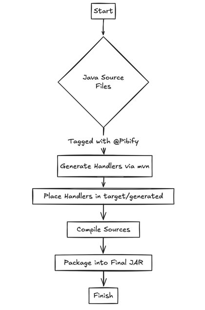
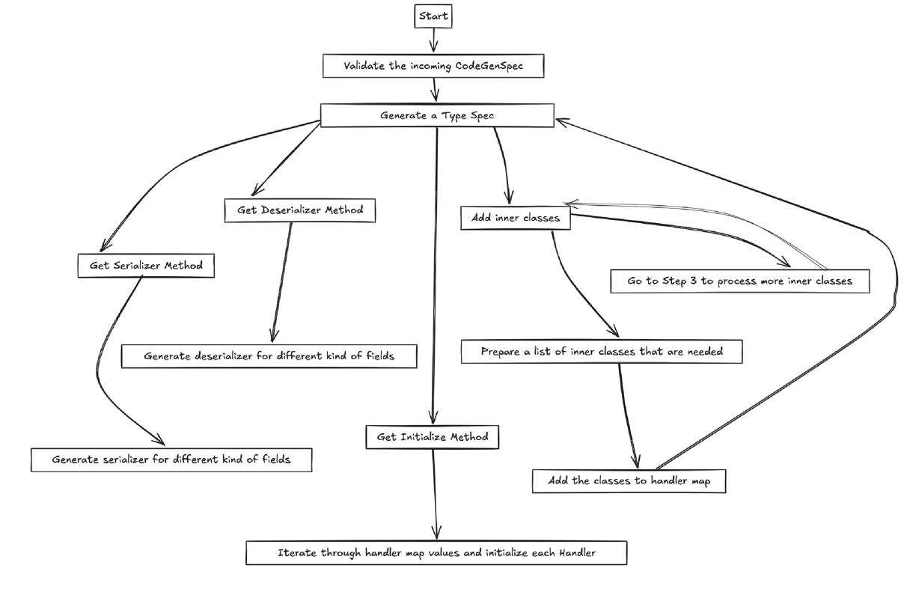

# Pibify

Protobuf-ify --> PB-IFY -> Pibify

Serve Java pojos as protobuf over the wire

# Concept

## Test cases

Refer to the list of test cases [here](pibify-core/src/main/java/com/flipkart/pibify/serde/serde.md)

## Terminologies

#### `@Pibify`
This is the annotation to be added on any field of a Pojo class that has to be transported

```java

@Pibify(1)
private String aStringVariable;

@Pibify(2)
private int anIntegerVariable;
```

#### Handler
This is the generated source corresponding to the Pojo where a `@Pibify` annotation is present.

```java
public abstract class PibifyGenerated<T> {
    public abstract byte[] serialize(T object) throws PibifyCodeExecException;

    public abstract T deserialize(byte[] bytes) throws PibifyCodeExecException;
}
```

#### `PibifyHandlerCache`
This is the class that the clients use to get an instance of Handler for the supplied class and then call the serialize or deserialize method on it.

## Flow



1. Add the dependency on `pibify-core` library
2. Add the `pibify-maven-plugin`
2.
   1. Use mvn target to annotate all classes within a given module using the mvn goal:
      `mvn com.flipkart.pibify:pibify-maven-plugin:annotate`
   1. Or, In the desired pojos, add the `@Pibify(<index>)` annotation manually
3. The maven plugin scans the source of the project during the build phase and collects all pojos which have the
   `@Pibify` annotation.
4. This plugin generates the `Handler` and `PibifyHandlerCache` for the configured module and places them at a suitable place in the package(jar)
5. Clients use the `PibifyHandlerCache` to get a reference to a `Handler` and call the `serialize`/`deserialize` method
   on it.


# Usage
1. Add the `pibify-core` dependency
```xml
<dependency>
    <groupId>com.flipkart.pibify</groupId>
    <artifactId>pibify-core</artifactId>
    <scope>compile</scope>
   <version>1.4</version>
</dependency>

```
2. Configure the model mvn module by adding the below plugin config
```xml
<plugin>
    <groupId>com.flipkart.pibify</groupId>
    <artifactId>pibify-maven-plugin</artifactId>
   <version>1.4</version>
   <configuration>
      <excludes>
         <exclude>com/flipkart/pibify/toskip/**</exclude>
         <exclude>com/flipkart/pibify/toskip2/**</exclude>
      </excludes>
   </configuration>
   <dependencies>
      <!-- 
      Due to a current limitation in dependency management, the mvn plugin will not be able 
      to resolve transition dependencies of the module. They need to be copied over explicitly, 
      if they are needed to compile the models   
      -->
      <!-- Copy over all module dependencies here -->
   </dependencies>
    <executions>
        <execution>
           <id>generate-pibify-sources</id>
            <goals>
                <goal>generate</goal>
            </goals>
            <phase>process-classes</phase>
        </execution>
    </executions>
</plugin>
<plugin>
    <groupId>org.codehaus.mojo</groupId>
    <artifactId>build-helper-maven-plugin</artifactId>
    <version>3.2.0</version>
    <executions>
        <execution>
           <id>add-pibify-source</id>
            <phase>process-classes</phase>
            <goals>
                <goal>add-source</goal>
            </goals>
            <configuration>
                <sources>
                    <source>${project.build.directory}/generated-sources/pibify</source>
                </sources>
            </configuration>
        </execution>
    </executions>
</plugin>
<plugin>
<groupId>org.apache.maven.plugins</groupId>
<artifactId>maven-compiler-plugin</artifactId>
<version>${maven-compiler-plugin.version}</version>
<executions>
   <execution>
      <id>compile-generated-pibify-sources</id>
      <phase>prepare-package</phase>
      <goals>
         <goal>compile</goal>
      </goals>
   </execution>
</executions>
</plugin>
```

3. Either manually tag fields with the `@Pibify` annotation or run the mvn goal
   `mvn com.flipkart.pibify:pibify-maven-plugin:annotate` to scan through all pojos in the module and add the `@Pibify`
   annotation. You can also pass an optional system property `-Dreindex` to force overwrite existing Pibify annotations.
   Make use of the `exclude` config. Refer
   to [docs](https://maven.apache.org/plugins/maven-resources-plugin/examples/include-exclude.html) for more details.
4. As part of the `package` mvn goal, the handler code will be generated

# Integration with application containers

1. [vert.x](vertx.md)
2. [dropwizard](dropwizard.md)

# Low Level Design Details

## Flow for CodeGenerator



# Advanced Features

[Advanced Features](AdvancedFeatures.md)

[Parity Check](ParityCheck.md)